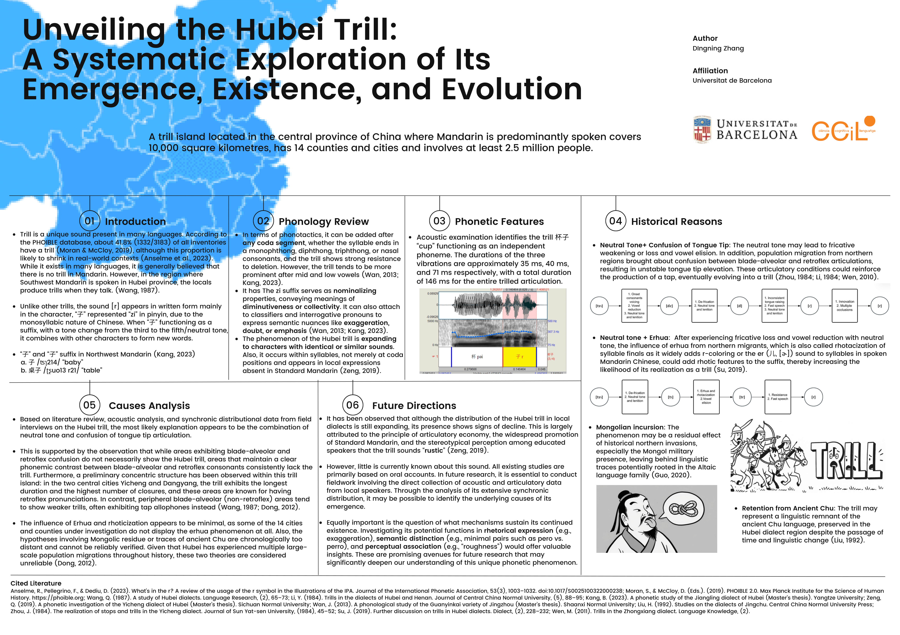

# Unveiling the Hubei Trill: A Systematic Exploration of Its Emergence, Existence, and Evolution

**Authors:** Dingning Zhang 
**Year:** 2025 
**Conference:** 'R-ATICS 8, Malta 

---

## Abstract

The trill, represented by the symbol in IPA, is a unique phoneme present in many languages. According to the PHOIBLE database, about 41.8% of all phonemic inventories include a trill. However, despite its prevalence, it is generally believed that Mandarin Chinese lacks a trill. This is, in fact, a misconception, as there are eight varieties of Mandarin, among which Beijing Mandarin has become the basis of standard Chinese phonology. Notably, one of these varieties, Southwest Mandarin, has the largest number of speakers, reaching up to 270 million.

Hubei Province, located in central China, is one of the fifteen provinces where Southwest Mandarin is spoken. Surprisingly, the locals in this region produce trills in their speech, which they refer to as ‘滚音’ (Rolling Sound). This distinctive linguistic phenomenon covers an area of approximately 10,000 square kilometers across 14 counties and cities, involving no fewer than 2.5 million speakers.

Unlike other trills, the Hubei trill is largely attached to a single Chinese character, ‘子,’ in Southwest Mandarin, likely due to the monosyllabic nature of the Chinese language. In Beijing Mandarin, this character is pronounced as /ʦɿ/ and means ‘baby’ when used as a single word. When functioning as a suffix for nominalization or diminutives, with a tone change from the third to the neutral tone, it combines with other characters to form new words. In Southwest Mandarin, specifically in Hubei, the pronunciation shifts from /ʦɿ/ to a trill /r/ while maintaining the same tone change. This suffix is so commonly used in daily conversations that visitors are often struck by the distinctive ‘Rolling Sound.’ Moreover, this phenomenon is reportedly expanding to include more characters, different word positions, and various dialectal usages.

Naturally, this study seeks to uncover why a ‘trill island’ exists in the middle of a country dominated by Beijing Mandarin, what factors have preserved and fostered its development, and how the phonetic and phonological features of the Hubei trill compare to other trills worldwide. To this end, the study employs a diachronic literature review as its primary methodology, focusing on historical and contemporary sources, utilizing prior phonetic experimental data, and investigating the emergence and evolution of the Hubei trill alongside its phonetic and phonological characteristics.

---

## Poster

